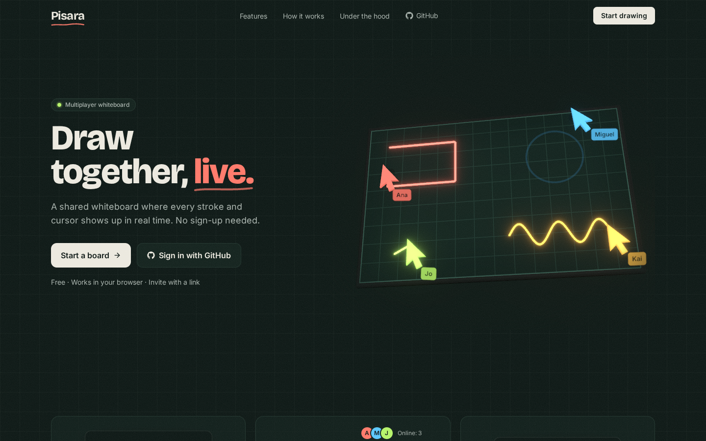

# Pisara

**Draw together, live.**

Pisara (Tagalog for "chalkboard") is a collaborative whiteboard that runs in the browser. Several people draw on the same infinite canvas at once and see each other's strokes and cursors in real time. Anyone can start drawing right away as a guest with just a name. Signing in with Google or GitHub is optional, and keeps your boards in a personal dashboard.

## What it does

- **Draw:** pen, line, rectangle, ellipse, arrow, text and eraser on an infinite canvas with pan and zoom.
- **Collaborate live:** strokes appear for everyone as they're drawn, with live cursors, name tags and a list of who's online.
- **Start without an account:** guests pick a name and start drawing. Signing in later keeps every board made as a guest.
- **Share by link:** invite people with editor or viewer access.
- **Undo only your own work:** each person has their own undo and redo, so you never undo a teammate's changes.
- **Never lose a board:** everything is saved, so a board looks exactly the same after a refresh or the next day.
- **Export:** download a board as a PNG.

## How it works

Pisara has no custom backend server. The React frontend talks directly to [Supabase](https://supabase.com), which handles sign-in, the Postgres database, real-time messaging, presence and file storage.

- **Real-time sync.** Each board is a set of independent elements: every stroke, shape and text box is its own element. Changes are broadcast to everyone on the board right away, then saved to Postgres in small batches, so drawing stays fast even when the database is slow.
- **Conflict handling.** Every element carries a version number. The database accepts a change only if it carries the next version, so stale edits are rejected and rolled back on the client.
- **Optimistic updates.** Your own changes appear instantly and are undone only if the database rejects them.
- **Security in the database.** Row-level security decides who can read or edit each board. Element writes go through a single Postgres function that checks the user's role, and board channels are private to members.
- **Smooth canvas.** Drawing runs on the HTML5 Canvas API outside React's render cycle, using a static layer for saved elements and an active layer for strokes in progress.

## Built with

React · Vite · Tailwind CSS · TypeScript · HTML5 Canvas · Zustand · Zod · Supabase (Auth, Postgres, Realtime, Storage) · Three.js and React Three Fiber (landing page) · Vercel

## Links

- **Source code:** https://github.com/ronronrivera/Pisara
- **Author:** Ron-ron Aspe Rivera, https://ronronrivera.tech
